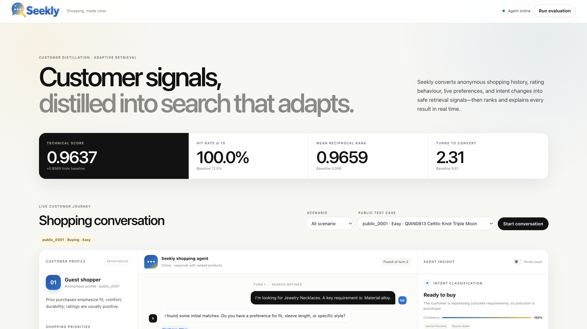
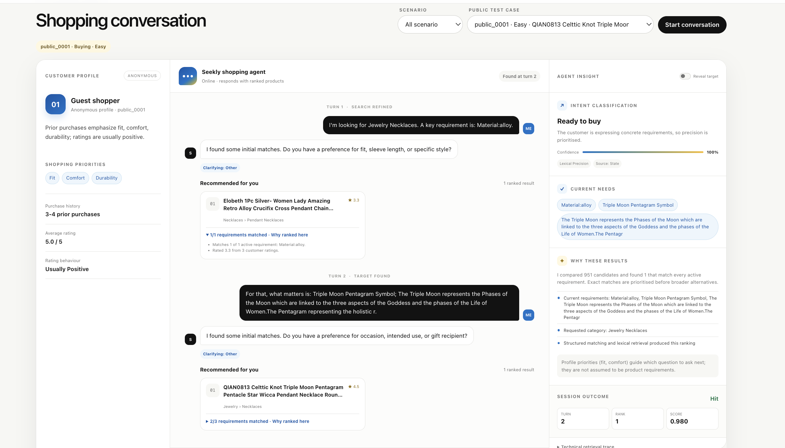

# Seekly

<p align="center">
  
</p>

<p align="center">
  
  
  
  
  
</p>

<p align="center">
  
  
  
  
</p>


**A profile-distilling, intent-aware shopping agent for the TechJam 2026
Conversational E-Commerce Search Challenge.**

Seekly turns a limited anonymous customer profile and a controlled multi-turn
dialogue into a ranked product shortlist. Its strongest submitted configuration
is deterministic and fully offline: no API key, model download, GPU, or semantic
index is required to reproduce the best public result.

> Public-set result: **1.000 Hit Rate@10 · 0.965853 MRR · 2.305 MTTC ·
> 0.963656 TechnicalScore**



## Live demo

**[Open the deployed Seekly shopping-agent demo](https://techjam-conversational-search.vercel.app/)**

The Vercel deployment is an optional, isolated presentation layer. It uses the
same deterministic Agent and participant-visible 50,000-product catalog, but it
does not replace or modify the competition entry point. No OpenRouter key,
model download, or dense index is required.

The live site includes all 200 public test cases, turn-by-turn and automatic
conversation playback, distilled customer profiles, intent classification,
ranked recommendations, transparent ranking evidence, and the validated
per-scenario metrics. A production smoke test on `public_0001` retrieved the
target at turn 2, rank 1, with a per-session score of `0.980`.

The first replay in a cold serverless instance may take approximately 20–30
seconds while Vercel prepares the catalog and request-local SQLite index.
This delay is specific to the hosted Vercel demo and does not apply when the
dashboard is run locally with `python -m dashboard.app`. Playback is immediate
once the replay response has loaded. The deployment adapter lives in
`api/index.py` and `vercel_app/`; the local dashboard and official evaluator
remain independent.

## Contents

- [Live demo](#live-demo)
- [What Seekly contributes](#what-seekly-contributes)
- [Results](#results)
- [How the four scenarios differ](#how-the-four-scenarios-differ)
- [System architecture](#system-architecture)
- [Retrieval and conversation logic](#retrieval-and-conversation-logic)
- [Models and semantic-search ablations](#models-and-semantic-search-ablations)
- [Run the winning configuration](#run-the-winning-configuration)
- [Run the dashboard](#run-the-dashboard)
- [Optional dense retrieval](#optional-dense-retrieval)
- [Reproducibility, latency, and cost](#reproducibility-latency-and-cost)
- [Limitations and future work](#limitations-and-future-work)
- [Competition compliance](#competition-compliance)

## Challenge in one paragraph

For each session, the agent receives an anonymous aggregate profile and a short
customer message. It may ask one structured clarification question and return
ordered product IDs on each turn. The evaluator stops at the first turn where
the hidden target's exact `parent_asin` appears in the first ten valid unique
recommendations, or after turn 10. The catalog contains 50,000 frozen
`Clothing_Shoes_and_Jewelry` products, while the released public set contains
200 sessions across Buying, Browsing, Intent Override, and Boundary scenarios.

The core metric is:

```text
Efficiency     = clip((11 - MTTC) / 10, 0, 1)
TechnicalScore = 0.50 × HR@10 + 0.30 × MRR + 0.20 × Efficiency
```

This creates a three-way objective: retrieve the target, rank it highly, and
surface it early without converting on weak evidence.

## What Seekly contributes

### 1. Safe customer-profile distillation

The evaluator exposes only an anonymous aggregate profile, not raw user IDs,
reviews, timestamps, or purchase history. Seekly distils that profile into:

- high-value dimensions that guide which question to ask next;
- positive preferences that can support ranking;
- avoidances that prevent obviously unsuitable recommendations.

The distinction is deliberate. A profile can guide clarification without being
treated as a hard product requirement. Only explicit, product-relevant
preferences enter live constraint matching. Broad signals such as rating style
or purchase frequency remain context rather than invented catalog filters.

### 2. Intent-aware, reversible conversation state

Seekly tracks buying, browsing, uncertain, boundary, and changed-intent
behaviour. A newly stated preference does not merely append to an immutable
query. When an override is detected, the superseded value is retracted from the
live intersection, retained only as weak historical context, and the exposure
history is reset. This prevents products shown for the old intent from being
penalized under the new one.

### 3. Question-value-inspired clarification

The question policy combines:

- inferred shopping mode;
- profile-priority dimensions;
- known and rejected constraints;
- variation among the current candidates;
- information already exhausted by the controlled customer simulator.

This is a deterministic approximation of question value rather than a claim of
full expected-information-gain optimization. It asks questions that can change
the candidate set and avoids repeatedly asking for unavailable information.

### 4. Progressive, exposure-aware recommendations

Returning ten speculative products immediately can score an accidental early
hit at a poor rank. Returning nothing wastes turns. Seekly exposes only rank 1
on turns 1–2 while gathering evidence, then opens the requested Top 10 from turn
3. Products already shown under the same intent receive a recoverable rank
penalty so new candidates can surface; no product is permanently deleted.

### 5. Structured retrieval with explicit provenance

The winning route combines exact attribute intersection, fielded BM25,
taxonomy-aware category matching, intent-specific weights, weak
retracted-context retrieval, reciprocal-rank fusion, override provenance, and
facet-diverse exploration. Every signal comes from participant-visible catalog
metadata, the supplied profile, or the current conversation.

### 6. Grounded, transparent explanations

The dashboard explains the ranking using the same state and diagnostics that
produced it: current requirements, ignored superseded preferences, requested
category, retrieval route, and profile dimensions used to choose the next
question. Explanations are generated after ranking and never alter the official
Agent response or score.



## Results

The following result was reproduced on all 200 released public sessions with
the repository's official evaluator unchanged and every remote component
disabled:

| Metric | Result |
|---|---:|
| Sessions | 200 |
| Hit Rate@10 | **1.000000** |
| MRR | **0.965853** |
| MTTC | **2.305** |
| Efficiency | **0.869500** |
| TechnicalScore | **0.963656** |
| Prompt + completion tokens | **0** |

### Performance by scenario

| Scenario | Cases | HR@10 | MRR | MTTC | Same-formula sector score |
|---|---:|---:|---:|---:|---:|
| Buying | 80 | 1.000 | 0.972619 | 1.8750 | 0.974286 |
| Browsing | 80 | 1.000 | 0.975000 | 2.2125 | 0.968250 |
| Intent Override | 30 | 1.000 | 0.928704 | 3.6000 | 0.926611 |
| Boundary | 10 | 1.000 | 0.950000 | 2.6000 | 0.953000 |

The sector score is included only as a diagnostic comparison; the official
TechnicalScore is calculated once across all sessions.

### Selected ablations

| Configuration | HR@10 | MRR | MTTC | Score |
|---|---:|---:|---:|---:|
| Organizer BM25 starter | 0.125 | 0.068034 | 9.810 | — |
| Structured lexical agent | 0.995 | 0.741480 | 2.055 | 0.898844 |
| Progressive rank-1 opening | 1.000 | 0.949056 | 2.345 | 0.957817 |
| + category suffix and retracted-context route | 1.000 | 0.951964 | 2.325 | 0.959089 |
| + override provenance | 1.000 | 0.953978 | 2.320 | 0.959793 |
| + filtered Qwen dense fusion after overrides | 1.000 | 0.954395 | 2.320 | 0.959918 |
| **+ exposure demotion, deterministic/offline** | **1.000** | **0.965853** | **2.305** | **0.963656** |

An additional catalog-derived 100-case diagnostic set uses target products not
present in the public labels. The current offline configuration scores 99/100
hits; its remaining miss sits in a group of metadata-identical candidates whose
target evidence is not available to the simulator. This suite is diagnostic,
not an estimate of the private leaderboard. See
[docs/diagnostic_holdout_results.md](docs/diagnostic_holdout_results.md).

## How the four scenarios differ

The Agent contract is the same for every case, but routing and state transitions
are scenario-aware:

| Scenario | Customer behaviour | Seekly response |
|---|---|---|
| Buying | A comparatively specific purchase goal | Prioritize exact constraints, lock strong evidence, and rank for early precision |
| Browsing | Exploratory language and weaker commitment | Use broader weights, profile-guided clarification, and preserve candidate diversity |
| Intent Override | A preference changes after earlier turns | Retract the old value, preserve it only as weak context, reset exposure state, and rerank from the replacement intent |
| Boundary | Missing, rejected, or non-applicable attributes | Avoid inventing requirements, mark unavailable fields, and continue safely with the evidence that exists |

The implementation does not read scenario labels from the evaluator. It derives
these behaviours from conversation state, rule-based intent signals, answers,
and override events.

## System architecture

```text
reset(session_id, user_profile)
        │
        └── profile distillation
              ├── important dimensions
              ├── positive preferences
              └── avoidances

respond(session_id, user_message, turn, top_k)
        │
        ├── answer parsing + intent classification
        ├── reversible constraint and exposure state
        ├── clarification policy
        │
        └── structured retrieval
              ├── exact attribute intersection
              ├── fielded BM25 and taxonomy suffix route
              ├── intent-specific weights
              ├── weak retracted-context route
              └── optional Qwen dense routes
                         │
                  weighted reciprocal-rank fusion
                         │
                  override provenance reranking
                         │
                  exposure demotion + exploration
                         │
             rank 1 on turns 1–2; Top 10 from turn 3
```

The competition entry point is [starter/agent.py](starter/agent.py). It exports
`Agent`, a thin subclass of the stateful
[shopping_agent/agent.py](shopping_agent/agent.py) implementation.

## Retrieval and conversation logic

### Profile and message interpretation

On `reset`, the agent stores isolated state for that session and distils the
profile. On each `respond` call it:

1. interprets the latest answer;
2. adds, rejects, or retracts structured constraints;
3. updates intent and browsing mode;
4. builds a semantic text view for diagnostics or optional dense retrieval;
5. selects the next useful clarification focus;
6. retrieves and ranks candidates;
7. returns a valid structured response and zero usage for the offline path.

Fixed evaluator phrases are handled deterministically. Conservative optional
GPT-5.6 Luna interpreters exist for less controlled real-world language, but a
remote failure always falls back to the rule route.

### Candidate generation

The lexical catalog index uses normalized catalog metadata and field-aware
tokenization. Strong active constraints narrow or lock the candidate pool.
Independent routes then rank:

- exact structured matches;
- title, feature, description, category, brand, and metadata BM25 evidence;
- the exact normalized suffix of the catalog taxonomy;
- profile evidence where it is safe to apply;
- low-weight retracted context after an override.

The final lexical pool is merged by weighted reciprocal-rank fusion (RRF).
Because RRF uses positions rather than incomparable raw scores, exact and BM25
routes can be combined without pretending their score scales are calibrated.

### Post-retrieval policy

The deterministic override-provenance route asks whether each candidate's
ordered visible attributes plausibly fit the sequence of disclosed constraints.
It never imports target labels or evaluator state. The original fused order
breaks ties.

Previously exposed products then receive a temporary rank penalty. When the
customer changes intent, exposure state resets because a product shown for the
old preference is not negative evidence for the new one. If information is
exhausted and the ranking is unchanged, facet-diverse exploration rotates
unseen candidates through the available Top 10.

## Models and semantic-search ablations

Seekly implements optional model-backed components through OpenRouter:

| Purpose | Model | Status in winning run |
|---|---|---|
| Natural answer extraction | `openai/gpt-5.6-luna` | Disabled |
| Ambiguous intent classification | `openai/gpt-5.6-luna` | Disabled |
| Query rewriting | `openai/gpt-5.6-luna` | Disabled |
| Product/query embeddings | `qwen/qwen3-embedding-8b`, 512 dimensions | Disabled |
| Cross-encoder reranking | `qwen/qwen3-reranker-8b` | Disabled |

The optional semantic index contains two Qwen embeddings per product:

- an identity view emphasizing title, category, brand, and product type;
- an attribute view emphasizing material, color, style, features, and
  description.

At runtime, the same Qwen model embeds the accumulated query. Dense retrieval
can be restricted to the first 1,000 structured candidates from turn 3 onward,
then fused with lexical, identity, and attribute rankings.

This implementation is complete but not enabled in the best submission.
Catalog-exact evaluator answers favor structured retrieval: dense fusion across
all intent tracks lowered MRR, and override-only dense fusion scored
`0.959918`, below the final offline `0.963656`. Semantic retrieval is
therefore retained as an auditable experiment and real-world extension, not
presented as a performance requirement.

## Run the winning configuration

### Prerequisites

- Python 3.10–3.12; the reported run used Python 3.12.1
- approximately 250 MB of free disk space after catalog extraction
- no third-party Python package for the winning offline path
- no API key, model download, GPU, or network connection

### 1. Clone and prepare the catalog

```bash
git clone https://github.com/ChenHongshan333/techjam-conversational-search.git
cd techjam-conversational-search

shasum -a 256 -c SHA256SUMS
gzip -dk catalog.jsonl.gz
mkdir -p data
mv catalog.jsonl data/catalog.jsonl
```

If `data/catalog.jsonl` already exists, do not overwrite it; verify that it
came from the supplied `catalog.jsonl.gz`.

### 2. Create an isolated Python environment

```bash
python3 -m venv .venv
source .venv/bin/activate
cp .env.example .env
```

The checked-in `.env.example` already selects the validated deterministic
configuration and leaves all remote routes disabled.

### 3. Run the official local harness

```bash
python -m evaluator.local_evaluator --output results.json
```

Expected aggregate output:

```text
sample_count:                 200
hit_rate_at_10:               1.0
mrr:                          0.965853
mttc:                         2.305
efficiency:                   0.8695
recommended_technical_score: 0.963656
reported total tokens:       0
```

Windows PowerShell equivalents:

```powershell
py -3.12 -m venv .venv
.venv\Scripts\Activate.ps1
Copy-Item .env.example .env
python -m evaluator.local_evaluator --output results.json
```

### 4. Run tests

```bash
python -m unittest discover -s tests -v
```

## Run the dashboard

The dashboard is an optional demonstration layer; the official evaluator
imports the Python Agent directly and does not require a URL or fixed port.

For a hosted version, use the
[live Vercel demo](https://techjam-conversational-search.vercel.app/). It runs
the deterministic replay path and displays the validated offline evaluation;
the full 200-case evaluator remains a local command.

```bash
python -m dashboard.app --port 8000
```

Open [http://127.0.0.1:8000](http://127.0.0.1:8000). If port 8000 is occupied,
choose another port, for example `--port 8010`.

The portal provides:

- aggregate TechnicalScore and per-scenario evidence;
- any public test case replayed one turn at a time or automatically;
- a customer-style conversation;
- distilled customer-profile signals;
- intent classification, confidence, and source;
- current and retracted requirements;
- brief ranking explanations and a collapsible technical trace;
- optional target reveal for local debugging.

## Optional dense retrieval

Dense retrieval is **not needed to reproduce the best score**. It requires
NumPy, OpenRouter access, a Qwen-compatible embedding endpoint, and the supplied
catalog index.

The repository includes `submission-assets.zip`, whose checksum is recorded in
`SHA256SUMS`. Extract it from the repository root:

```bash
unzip submission-assets.zip
python -m pip install -r requirements-semantic.txt
```

Then enable the measured override-only route:

```bash
export OPENROUTER_API_KEY=your_key
export TECHJAM_SEMANTIC_INDEX_PATH=artifacts/semantic_cache/catalog_qwen3_embedding_8b_512_v1.npz
export TECHJAM_DENSE_RETRIEVAL=1
export TECHJAM_DENSE_FILTERED=1
export TECHJAM_DENSE_MIN_TURN=3
export TECHJAM_DENSE_CANDIDATE_POOL_SIZE=1000
export TECHJAM_DENSE_TRACKS=override
export TECHJAM_LLM_REWRITE=0
export TECHJAM_RERANK=0

python -m evaluator.local_evaluator --output results-dense.json
```

OpenRouter remains necessary to embed each new conversation query with the same
Qwen model used for the index. If the provider, key, or index is unavailable,
the agent records a diagnostic and falls back to deterministic lexical ranking.

To rebuild the index instead:

```bash
python -m shopping_agent.build_semantic_index
```

The builder checkpoints successful batches and resumes after interruptions. It
embeds only participant-visible catalog text; no target labels or private
sessions enter the index.

## Reproducibility, latency, and cost

### Reported winning run

| Item | Disclosure |
|---|---|
| Source revision | Current repository state; record the final frozen hash with `git rev-parse HEAD` |
| Evaluator | Unmodified released `evaluator.local_evaluator` |
| Platform | macOS 26.4.1, Apple Silicon (`arm64`) |
| Python | 3.12.1 |
| Public sessions / Agent turns | 200 / 461 |
| End-to-end evaluator wall time | 55.37 seconds |
| Approximate mean wall time | 277 ms/session; 120 ms/Agent turn |
| External requests | 0 |
| Prompt / completion tokens | 0 / 0 |
| Model cost | US$0 for the winning run |

The timings include catalog loading, evaluator simulation, ranking, and writing
the result file on one development laptop. They are observations, not a timeout
guarantee; the official policy does not define standardized hardware.

### Important environment variables

| Variable | Winning value | Purpose |
|---|---:|---|
| `TECHJAM_DENSE_RETRIEVAL` | `0` | Keep Qwen retrieval disabled |
| `TECHJAM_LLM_ANSWER` | `0` | Use deterministic answer parsing |
| `TECHJAM_LLM_INTENT` | `0` | Use deterministic intent rules |
| `TECHJAM_LLM_REWRITE` | `0` | Do not rewrite the query remotely |
| `TECHJAM_RERANK` | `0` | Disable external reranker |
| `TECHJAM_OVERRIDE_LIKELIHOOD` | `1` | Enable deterministic override provenance |
| `TECHJAM_RETRACTED_WEIGHT` | `0.25` | Keep weak historical evidence |
| `TECHJAM_EARLY_RECOMMENDATION_LIMIT` | `1` | Return rank 1 on opening turns |
| `TECHJAM_EXPOSURE_DEMOTION` | `1` | Rotate recoverably past shown candidates |
| `TECHJAM_EXPOSURE_RANK_PENALTY` | `10` | Exposure penalty used in the validated run |

The complete reproducible configuration is in [.env.example](.env.example).
Exported environment variables take precedence over values loaded from
`.env`. Never commit a real `OPENROUTER_API_KEY`.

## Limitations and future work

### Current limitations

- **Controlled language:** public and final customer replies use deterministic
  templates keyed by `ask_attribute`. The offline parser is optimized for
  that contract, not arbitrary multilingual shopping language.
- **Limited customer history:** the supplied profile is aggregated and
  anonymous. Seekly cannot inspect raw purchases, returns, reviews, timestamps,
  price sensitivity, or cross-session sequences.
- **Parent-product granularity:** the catalog key represents a parent ASIN, not
  a specific color/size SKU. Exact inventory availability cannot be guaranteed.
- **Frozen text-only catalog:** there are no live price, stock, delivery, image,
  video, or seller-quality signals.
- **Metadata-identical candidates:** if the evaluator cannot disclose a
  distinguishing attribute, ranking becomes an exploration problem rather than
  a semantic-recall problem.
- **Public-set tuning risk:** ablations are measured on 200 released labels.
  The catalog-derived diagnostic suite reduces, but cannot eliminate, private
  distribution risk.
- **Explanation boundary:** rich explanations live in the optional dashboard;
  the competition Agent's natural-language message remains intentionally brief.

### Real-world shopping-copilot roadmap

1. **Confidence-controlled language understanding.** Use an LLM to interpret
   multilingual, indirect, contradictory, and free-form replies, but preserve
   deterministic schema validation, confidence thresholds, and a safe fallback.
2. **Consented behavioral modeling.** Add purchases, returns, dwell time,
   searches, budgets, size history, brand affinity, and temporal decay with
   explicit privacy controls and user-editable profile memory.
3. **True question-value estimation.** Learn the expected reduction in candidate
   uncertainty and customer effort from each possible question, then stop
   questioning when expected value becomes negative.
4. **Live commerce constraints.** Join variants, price, inventory, shipping
   time, seller quality, promotions, and policy constraints before presenting a
   purchasable shortlist.
5. **Multimodal and scalable retrieval.** Add product image embeddings, an
   incremental ANN/vector index, better learned fusion, and cross-encoder
   reranking only where confidence or ambiguity justifies its latency.
6. **Faithful conversational explanations.** Bring concise ranking evidence
   into the actual chat response and let customers correct the inferred
   preference or intent that influenced a result.
7. **Online evaluation.** Measure task completion, add-to-cart and purchase
   conversion, return rate, satisfaction, clarification burden, latency, cost,
   and fairness through guarded A/B tests rather than optimizing only offline
   target recovery.

## Repository map

```text
starter/agent.py                       official Agent entry point
shopping_agent/agent.py                conversation and retrieval orchestrator
shopping_agent/conversation/           intent, answer, profile, state, questions
shopping_agent/retrieval/              lexical, semantic, fusion, exploration
shopping_agent/providers/              optional OpenRouter client
shopping_agent/build_semantic_index.py resumable Qwen index builder
evaluator/local_evaluator.py           released simulator and scorer
dashboard/                             local customer-style replay portal
data/public_set.jsonl                  200 labeled development sessions
docs/                                  contract, ablations, and diagnostics
tests/                                 API, behavior, dashboard, evaluator tests
```

## Competition compliance

- The submitted entry point exports the required `Agent` interface.
- Recommendations are exact catalog `parent_asin` values.
- The official evaluator and public labels are not imported by the Agent.
- Conversation state is isolated per session.
- The semantic index, when used, is derived only from participant-visible
  product text.
- No private labels, organizer-only files, raw user histories, or secrets are
  included.
- API credentials are accepted only through `OPENROUTER_API_KEY`.
- The winning route is offline and has a zero-cost fallback by construction.

Before final evaluation, freeze the submitted Git commit. Run the unmodified
official evaluator from that commit, retain `results.json`, record the commit
hash and environment, and do not change the Agent, prompts, indexes, or model
configuration after the final package is released. See the official
[Submission Rules](https://github.com/TechJam2026/techjam-conversational-search/blob/main/docs/submission_rules.md)
and
[Final Evaluation FAQ](https://github.com/TechJam2026/techjam-conversational-search/blob/main/docs/final_evaluation_faq.md).

## Data attribution

The competition package is derived from
[Amazon Reviews 2023](https://amazon-reviews-2023.github.io/) by McAuley Lab,
UCSD, using the `Clothing_Shoes_and_Jewelry` category and `parent_asin` join
key. See [DATA_ATTRIBUTION.md](DATA_ATTRIBUTION.md) for the required attribution
and use notice.
